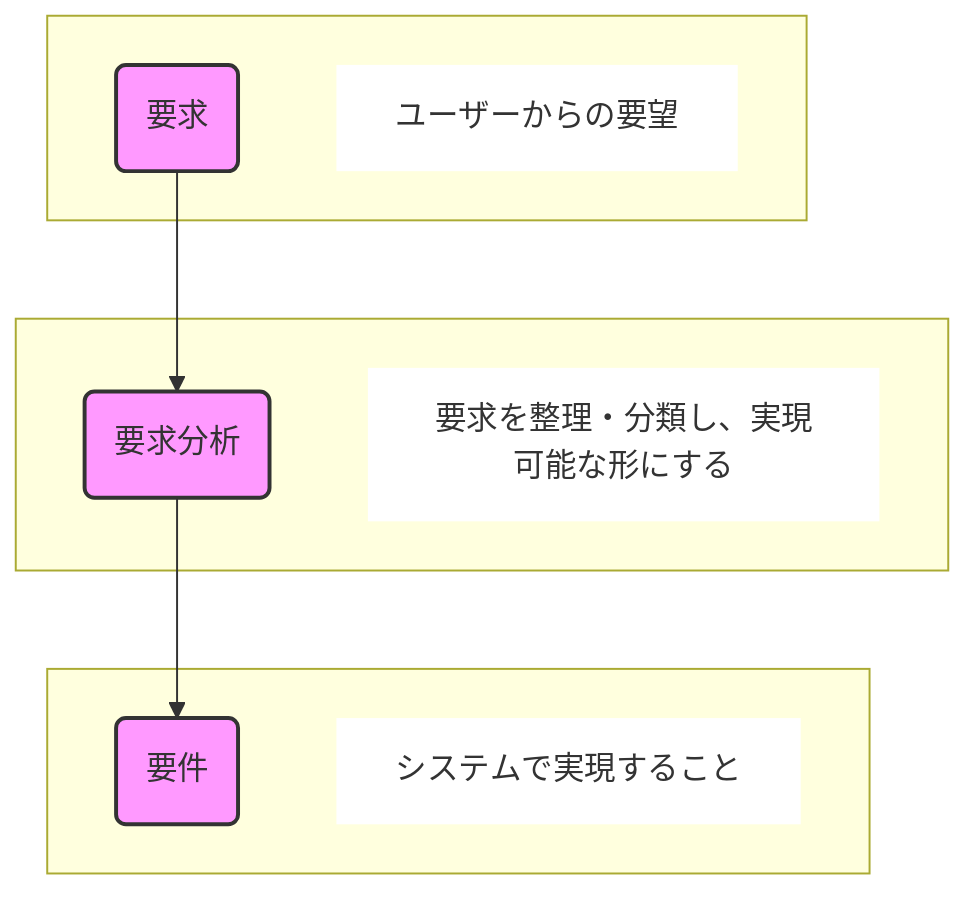

### 前置き
本資料は、現在、業務で要件定義工程に携わっており、そのチームメンバーへ向けて
「要件定義とは何か？」というテーマで勉強会を行ったときの資料になります。

（前提として、ウォーターフォールモデルでのシステム開発における要件定義工程についての勉強会となっております。）

---

### 要件定義とは
「要件定義」とはシステム開発で最も初めに行う工程です。
（ウォーターフォールモデルでいうと一番左上に位置する工程です）

開発するシステムの規模や内容にもよりますが、一定の規模を超えるシステム開発プロジェクトでは、「要件定義工程」が設けられます。

規模がそこまで大きくないシステム開発では「要件定義工程」が設けられないこともありますが、要件を定義する「要件定義プロセス」は必ず行っているはずです。
 
この勉強会ではこの重要な「要件定義プロセス」について、主に説明していきます。

:::note info
▼参考
[共通フレーム２０１３の概説](https://www.ipa.go.jp/archive/files/000027415.pdf)
p50 「（３）「Ｖ字モデルの採用」を提唱」
:::

---

### 要件定義のゴール
ウォーターフォールモデルにおける要件定義のゴールは下記を達成することとなります。
ただし、プロジェクトごとにゴールをどこに置くのか変わってくるため参画しているプロジェクトのゴールはどこなのかを理解しておく必要があります。

**■「要件定義工程」としてのゴール**
- 後続の設計工程以降の工数を見積もること
    - システムとして構築すべき範囲・総量が明確で後続の設計工程以降の工数を算出できること

**■「要件定義プロセス」としてのゴール**
- 後続の設計に手戻りなく移行できること
    - システム要件が確定しており、その要件・仕様を基に設計が行える状態であること

---
### 要件定義プロセスでやること
「要件定義プロセス」でやることは「要求」を「要求分析」を経て「要件」として定義することです。

- 要求・・・ユーザーが情報システムで実現したいこと（本当に欲しいもの）
- 要件・・・要求を基に制約※を踏まえシステムに盛り込むべきもの（本当に要るもの）

※制約となる要素としては「リソース（人・物・金）」「時間（スケジュール）」「技術的困難」「技術的制約」が考えられます。

---

### 【参考】要件を定義の制約要素について
- 人：技術スキルはあるか？マネージメントスキルはあるか？
- 物：ビジネスに必要な設備や環境、インフラ、ツールを用意できるか？
- 金：人員のコスト、インフラのコストをまかなえる資金があるか？
- 時間：納期は足りるか？
- 技術的困難：実現できる技術はあるか？その技術を使うことによるリスクはないか？
- 技術的制約：既存のシステムに統合して作る、クラウドを利用するなどの制約の中で対応可能か？

---

### 「要求」の分類について
要求は大きく3つに分類できます。
1. ビジネス要求・・・トップダウンの要求
1. 業務要求・・・業務レベルの要求
1. システム要求・・・システムレベルの要求

要件定義工程で議論されている要求が「ビジネス要求」「業務要求」「システム要求」のうちどれに該当するか考えてみるのも面白いです。

:::note info
▼参考
[共通フレーム２０１３の概説](https://www.ipa.go.jp/archive/files/000027415.pdf)
p42 「１．プロセス拡張のねらい」
:::

---

### 要件の種類
要件は大きく2つに分類できます。
1. 業務要件
1. システム要件

一般的には「①業務要件定義 → ②システム要件定義」の流れでプロセスが進み、
最終的「システム要件」を確定させることで、プロジェクトで構築するシステムの全容を定義することができます。

---

### システム要件定義プロセスについて
「システム要件」を定義するプロセスを「システム要件定義プロセス」と呼びます。
このプロセスでは「機能要件」と「非機能要件」をそれぞれ定義します。

**■機能要件**
- システムが「何を実現するか」を定義する要件。
- 具体的な機能や動作を明確にし、ユーザーが期待する処理を実装するための要件。

**■非機能要件**
- システムを「どのように実現するか」を定義する要件。
- システムの品質や動作特性、環境、制約を定める要件。

| 項目 | 説明　　　　　　　　　　　　　          　 |
|------|---------------------------|
| 性能| 応答速度、処理能力（例：1秒以内にページを表示） |
| 可用性 | システムの稼働率や耐障害性（例：99.99%の稼働率） |
| セキュリティ | 認証、アクセス制御、データ暗号化（例：パスワードはハッシュ化） |
| 拡張性 | システムの拡張・変更のしやすさ（例：1万ユーザー対応可能） |
| 保守性 | システムの修正・更新のしやすさ（例：コードのモジュール化） |
| 互換性 | 他システムやブラウザ、OSとの適合（例：iOS/Android対応） |
---

### システム要件定義で定めること

要件定義の全体のゴールは下記であるとご説明しました。

>**■「要件定義工程」としてのゴール**
>- 後続の設計工程以降の工数を見積もること
>    - システムとして構築すべき範囲・総量が明確で後続の設計工程以降の工数を算出できること
>
>**■「要件定義プロセス」としてのゴール**
>- 後続の設計に手戻りなく移行できること
>    - システム要件が確定しており、その要件・仕様を基に設計が行える状態であること

これを基に、「システム要件定義」に当てはめて考えた場合のゴールを考えてみましょう。

- 1点目の「工程」のゴールである「システムとして構築すべき範囲・総量が明確」という点を具体化すると下記となります。
    - 構築する機能（構築しない機能）が明確
    - 機能が満たす要件（満たさない要件）が明確

- 2点目の「プロセス」のゴールである「設計に手戻りなく移行できる」という点を具体化すると下記となります。
    - 各システム要件に対し5W1Hが明確にわかること

上記を意識して、システム要件定義が行われているか確認することが重要となります。

---

### システム要件の5W1Hとは
システム要件定義で5W1Hを使うと、抜け漏れのない仕様を検討しやすくなります。
つまり、仕様が明確になり、設計を行うことが可能になるということでもあります。

| 5W1H  | 機能要件定義での具体例　　　　　　　　　　　　　　　　　　　　　　　　　　　　　　　　 |
|-------|----------------------------------------------|
| Who（誰が）  | ユーザーが操作するのか？（一般ユーザー、管理者、システム）。 権限ごとに異なる機能が必要か？（例：一般ユーザーは閲覧のみ、管理者は編集可） |
| What（何を）  | どの機能を提供するのか？（例：ログイン機能、検索機能、データエクスポート機能）。 具体的にどんなデータを扱うのか？（例：ユーザー情報、注文履歴、商品データ） |
| When（いつ）  | ユーザーはいつ機能を使うのか？（リアルタイム？定期バッチ処理？）。 処理の実行タイミングは？（例：毎日0時にデータ同期、ボタン押下時にリアルタイム計算） |
| Where（どこで）  | どの環境で動作するのか？（Webアプリ？モバイルアプリ？PCのみ？）。 外部システムやクラウドサービスとの連携はあるか？ |
| Why（なぜ）  | なぜその機能が必要なのか？（例：業務効率化のため、法令対応のため）。 その機能を省略するとどんな問題が発生するか？ |
| How（どのように）  | どの技術・方式で実装するのか？（例：REST APIで連携、DBの正規化方式）。 UI/UXの仕様は？（例：シンプルな検索ボックス or 高度なフィルタ機能） |

各システム要件に対し、上記5W1Hすべてが明確に文章として定義されていればもちろんベストですが、必ずしも文章で定義されている必要性はなく、要件定義書の表現として全体的に読み取れる内容になっていれば問題ありません。

---
### 参考資料
- [共通フレーム２０１３の概説](https://www.ipa.go.jp/archive/files/000027415.pdf)
- [だまし絵を描かないための── 要件定義のセオリー](https://www.ric.co.jp/book/development/detail/219)

---

以上となります。
 
