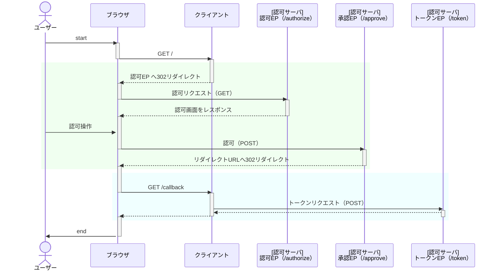

OAuth 2.0 の勉強のために認可コードグラントに対応した簡易認可サーバをExpress.jsで実装してみました。

https://github.com/fcf-koga/oauth-authz-server-express

## エンドポイント
下記のエンドポイントを実装しています。
- 認可エンドポイント
- トークンエンドポイント

トークンエンドポイントでは、リフレッシュトークンの発行にも対応させました。

```javascript:config.js
const authzServer = {
  authorizationEndpoint: serverAddress + "/authorize",
  tokenEndpoint: serverAddress + "/token",
  responseType: ["code", "token"],
};
```
## クライアント
クライアント情報は静的に登録しています。

```javascript:config.js
const clients = [
  {
    client_id: "client_id",
    client_secret: "client_secret",
    redirect_uris: [clientAddress + "/callback"],
    scope: ["foo", "bar"],
  },
];
```
余力があれば、動的クライアント登録（RFC7592）にも対応させたいと思っています。

## シーケンス図
シーケンスはこんな感じ。


それぞれのエンドポイントで何をやっているか簡単に説明していきます。
## 認可エンドポイント
認可コードを発行するエンドポイントです。

適切なクライアントからの認可リクエストを受付け、このクライアントに権限を委譲してよいかユーザーへ確認を行います。

ユーザーからクライアントへの権限委譲の許可を得られたら、その証として、認可コードを認可レスポンスとしてクライアントへ返します。

### 認可リクエスト

```
GET http://localhost:3000/authorize?client_id=client_id&redirect_url=http://localhost:9000/callback&response_type=code&scope=foo%20bar&state=201
```
認可エンドポイントでは、認可リクエストパラメータのチェックを行います。
すべてのチェックが正常に行われれば、認可ページをブラウザに返します。

| 処理順 | パラメータ | 必須 | チェック内容 | エラーレスポンス |
|:-:|:-:|:-:|:-|:-|
| 1 | client_id | ◯ | 登録されているクライアントIDと一致すること  | 認可サーバのページに「Unknown client」を表示  |
| 2 | redirect_url  | ー | 指定されている場合、クライアント情報に設定されているリダイレクトURLと一致すること  | 認可サーバのページに「Invalid redirect URI」を表示  |
| 3 | response_type  | ◯ | 認可サーバで対応している種別（`code`のみ）と一致すること  | リダイレクトURLへ「unsupported_response_type」エラーを返す  |
| 4 | scope | ◯（※） | 認可サーバで対応しているscope値とすべて一致すること。  |  リダイレクトURLへ「invalid_scope」エラーを返す |

※`scope`は仕様では任意だが、今回作成した認可サーバでは、必須扱いとしています。

### 認可レスポンス
```
http://localhost:9000/callback?code=uEH2mhRn4Gfjthwh&state=201
```
認可ページでユーザーが認可を承認した場合、認可レスポンスとして、リダイレクトURLへのリダイレクトを返します。
そのとき、パラメータに発行した認可コードを付与します。

認可レスポンスでは`code`パラメータは必須となり、`state`パラメータは認可リクエストに含まれていた場合、必須となります。


## トークンエンドポイント
アクセストークンおよびリフレッシュトークンを発行するエンドポイントです。
適切なクライアントからトークンリクエストを受付け、認可コードを元にトークンを発行します。

### クライアント認証
トークンエンドポイントでは、クライアント認証も行います。
クライアント認証は、リクエストヘッダーやボディに含まれるクライアントIDとシークレットを検証することで行います。

Http Basic認証またはリクエストボディのいずれかの方法で`client_id`、`client_secret`を渡せるようになっています。

### トークンリクエスト
```
POST http://localhost:3000/token
```
トークンエンドポイントでは、トークンリクエストボディのパラメータチェックを行います。

すべてのチェックが正常に行われれば、トークンをクライアントに返します。

| 処理順 | パラメータ | 必須 | チェック内容 | エラーレスポンス |
|:-:|:-:|:-:|:-|:-|
| 1  | grant_type | ◯ | `authorization_code`または`refresh_token`であるかを確認  | クライアントへ「unsupported_grant_type」エラーを返す  |
| 2  | code | ◯ | 認可レスポンスで返した認可コードと一致すること  | クライアントへ「invalid_grant」エラーを返す  |
| 3  | client_id | ー | 指定されている場合、認可リクエスト時の`client_id`と一致すること  | クライアントへ「invalid_grant」エラーを返す |

### トークンレスポンス
```
{
    "access_token": "w1boanear7T92toNv7UYfEgMrTnfAigL",
    "refresh_token": "uCWgP7ONnbQaCAqrDifJbuLouPTYsygO",
    "token_type": "Bearer",
    "scope": "foo bar"
}
```
トークンレスポンスとして、トークン情報以外にも、`token_type`や`scope`を返します。

`token_type`はアクセストークンがBearer（持参人）トークンとして、提示することを期待していることを表しています。
`scope`は、アクセストークンがどのスコープで権限委譲されたかを表しています。

## 最後に
簡単に、今回実装した簡易認可サーバの仕様について説明しました。

OAuth 2.0 を知れば知るほど、わかってたつもりがよくわからなくなったりと、まだまだ完璧に理解した！とまで言えない奥が深い仕様だなーと改めて感じました。

まだまだ改善や拡張の残る状態ではありますが、そこについては今後の余力次第で対応していきたいと思っています。

## 参考
- [OAuth徹底入門 セキュアな認可システムを適用するための原則と実践](https://www.amazon.co.jp/OAuth%E5%BE%B9%E5%BA%95%E5%85%A5%E9%96%80-%E3%82%BB%E3%82%AD%E3%83%A5%E3%82%A2%E3%81%AA%E8%AA%8D%E5%8F%AF%E3%82%B7%E3%82%B9%E3%83%86%E3%83%A0%E3%82%92%E9%81%A9%E7%94%A8%E3%81%99%E3%82%8B%E3%81%9F%E3%82%81%E3%81%AE%E5%8E%9F%E5%89%87%E3%81%A8%E5%AE%9F%E8%B7%B5-Justin-Riche-ebook/dp/B07L5M7DXS/ref=sr_1_1?__mk_ja_JP=%E3%82%AB%E3%82%BF%E3%82%AB%E3%83%8A&crid=1ZKUBLWXFY66G&dib=eyJ2IjoiMSJ9._OzFkC3HwgVf5JBTscN-LpvwSYhlRVROwx8ioQBimxSseIKboUTT-ZayOlUoVbc1LxxypAdjNxAcyDUCj0WJOw3BD6SMC3JxKi42WaA2hcgBfooBCDwBkaj6eG-hNlTX6nitROYDJy5pWZvqjQh6fD4pQsXjhtpxQ49pw33TfmXmovw87WdKJrQGdPAbYF74RjQCJNfWEtzzFhMY9FlXZmH4QUds0sU2MyX-oeHd_Sc.6qfjsHLrdBiA1b-HezJCOfn_YttREDuBaviKab-bWR0&dib_tag=se&keywords=oauth%E5%BE%B9%E5%BA%95%E5%85%A5%E9%96%80&qid=1721775831&s=english-books&sprefix=oauth+%E5%BE%B9%E5%BA%95%E5%85%A5%E9%96%80%2Cenglish-books%2C143&sr=1-1)
